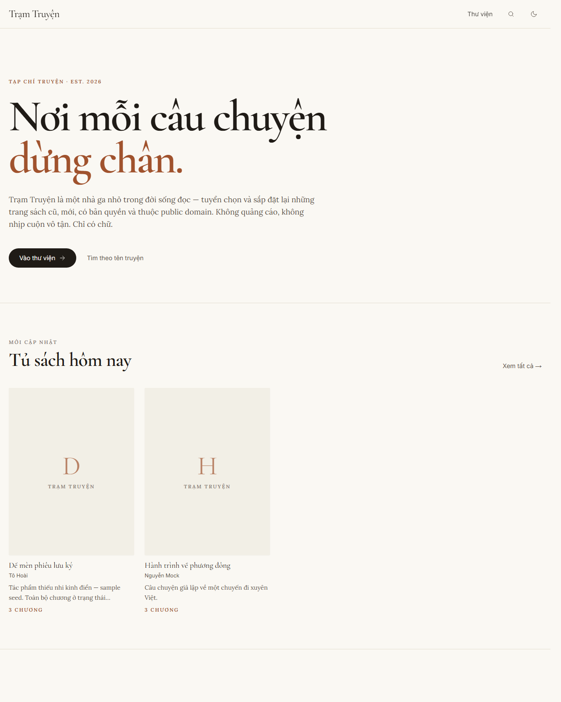
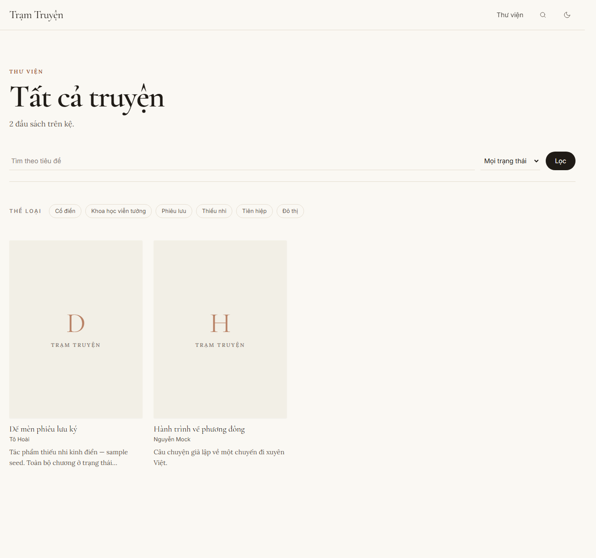
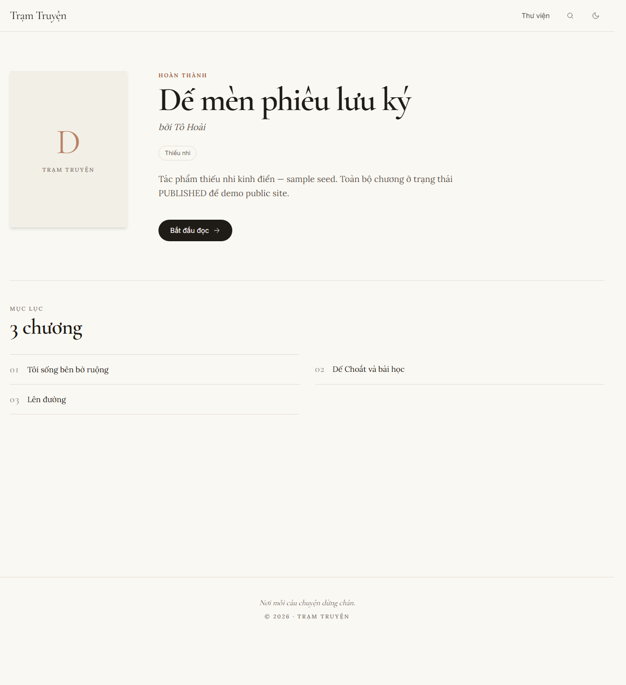
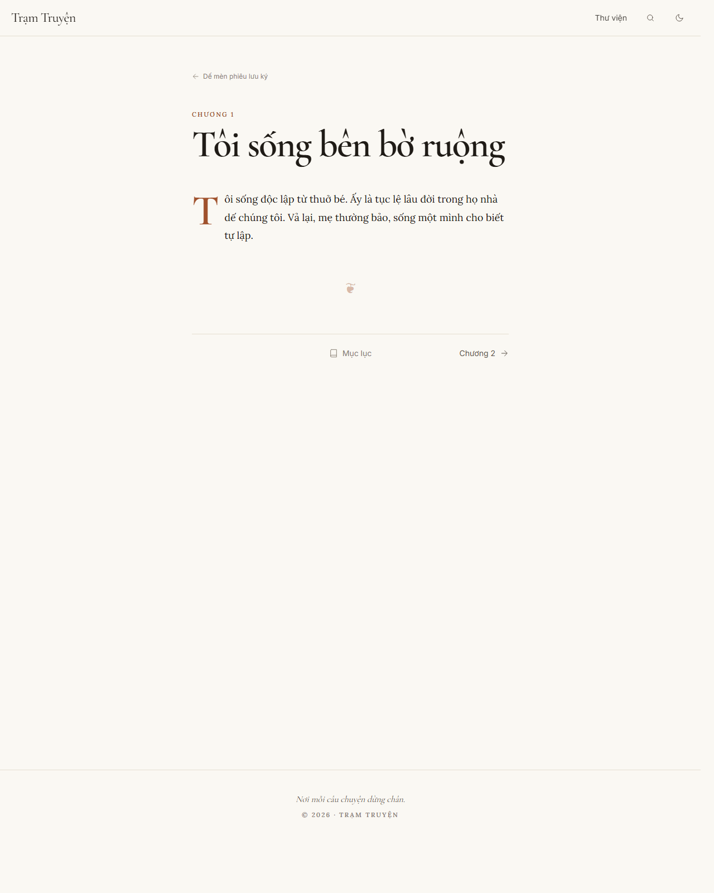

# Trạm Truyện

> "Trạm Truyện — nơi mỗi câu chuyện dừng chân."

MVP đọc truyện: public site mobile-first + admin CMS + crawler hợp pháp + workflow duyệt/hẹn giờ.



| Thư viện | Trang truyện | Reader |
|---|---|---|
|  |  |  |

## Stack

Next.js 15 · TypeScript · Tailwind · shadcn/ui · Prisma · PostgreSQL 16 · BullMQ · Redis 7 · NextAuth v5 · pnpm monorepo · Docker Compose.

Typography: Cormorant Garamond (display) · Lora (body) · Inter (UI).

## Quick Start

Yêu cầu: Node ≥ 20, pnpm ≥ 10, Docker Desktop.

```bash
cp .env.example .env
pnpm install
pnpm compose:up           # postgres + redis
pnpm db:migrate           # init schema
pnpm db:seed              # seed admin/editor user
pnpm dev                  # web + worker (HMR)
```

Public: <http://localhost:3000> · Admin: <http://localhost:3000/admin> · Login: `admin@tramtuyen.local` / `changeme123` (sửa trong `.env`).

Xem `docs/run-local.md` cho chi tiết.

## Layout

```
apps/web         Next.js public + /admin
apps/worker      BullMQ worker (crawl + publish)
packages/db      Prisma schema + client + seed
packages/core    domain types, slugify, hash, license guard, schemas
docker           compose, Dockerfiles
```

## Status

MVP shipped — 8 phases hoàn thành. UI v2 (editorial redesign) đang sống.
Plan gốc: `plans/260505-2111-tram-tuyen-mvp/`.
